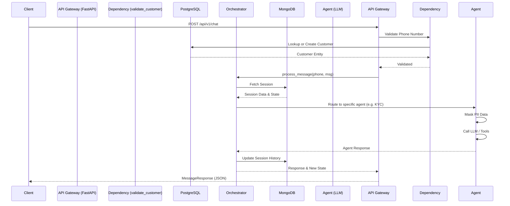

# API Documentation

## API Overview

- **Base URL**: `http://localhost:8000/api/v1` (development)
- **Versioning Strategy**: URI Versioning (currently `/v1/`)
- **Authentication**: Implicit via device/phone number verification (injected via `validate_customer` dependency middleware).

---

## Request Lifecycle

The API acts as a gateway to the multi-agent orchestration system.



---

## Authentication

- Currently relies on a `phone_number` payload combined with channel verification (e.g., WhatsApp authenticated webhook). 
- In `development` mode, it overrides the payload `phone_number` with `MOCK_NUM` from the `.env` file.

---

## Endpoint Documentation

### POST /api/v1/chat

#### Purpose
Main endpoint to process conversational messages from users. It routes the message through the state machine and returns the AI's response.

#### Request Headers
- `Content-Type`: `application/json`

#### Query Parameters
- *None*

#### Path Parameters
- *None*

#### Request Body Schema
`MessageRequest`
```json
{
  "phone_number": "string (optional in dev, required in prod)",
  "channel": "string (default: 'WHATSAPP')",
  "message": "string (The actual chat message from the user)"
}
```

#### Validation Rules
- `message` must be a valid string.
- `channel` is string, defaults to `WHATSAPP`.

#### Business Logic Flow
1. Receives payload.
2. Intercepted by `validate_customer` dependency.
3. If `customer` does not exist in Postgres, a temporary customer record is created.
4. Checks MongoDB for an active session. If none, `Orchestrator.start_session()` creates one.
5. Passes `session_id` and `message` to `Orchestrator.process_message()`.
6. Returns the combined AI response and the updated workflow state.

#### Response Schema
`MessageResponse`
```json
{
  "session_id": "string (UUID)",
  "response": "string (AI generated response)",
  "current_state": "string (Workflow state enum)"
}
```

#### Success Responses
**200 OK**
```json
{
  "session_id": "f47ac10b-58cc-4372-a567-0e02b2c3d479",
  "response": "Hello! Welcome to SBI Saarthi. I can help you with your account opening process. Could you please share your preferred language?",
  "current_state": "UNIDENTIFIED"
}
```

#### Error Responses
**422 Unprocessable Entity** (Validation Error)
```json
{
  "detail": [
    {
      "loc": ["body", "message"],
      "msg": "field required",
      "type": "value_error.missing"
    }
  ]
}
```
*(Standard FastAPI validation error)*

#### Dependencies
- `middlewares.dependencies.validate_customer`: Injects the Postgres `Customer` model into the request context.

#### Security Requirements
- Ensure channel (WhatsApp) webhook signatures are verified (to be implemented at the gateway/proxy level).

#### Internal Services Used
- `Orchestrator`: For agent routing.
- `database.mongo_helpers`: For session retrieval.
- `database.postgres_helpers`: For customer lookup/creation.

---

## Data Contracts

### Request Model: `MessageRequest`
```json
{
  "phone_number": "9876543210",
  "channel": "WHATSAPP",
  "message": "Hi, I want to open an account"
}
```

### Response Model: `MessageResponse`
```json
{
  "session_id": "550e8400-e29b-41d4-a716-446655440000",
  "response": "Sure, I can help you. Please provide your Aadhaar number.",
  "current_state": "IDENTIFIED"
}
```

### Schema: `CustomerProfile`
```json
{
  "customer_id": 1,
  "phone_number": "9876543210",
  "preferred_language": "English",
  "kyc_status": "PENDING",
  "risk_tier": "LOW",
  "created_at": "2023-10-27T10:00:00Z"
}
```

### Schema: `SessionMemory`
```json
{
  "session_id": "550e8400-e29b-41d4-a716-446655440000",
  "customer_id": 1,
  "channel": "WHATSAPP",
  "workflow_state": "KYC_INITIATED",
  "messages": [
    {"role": "user", "content": "Here is my aadhaar", "timestamp": "2023-10-27T10:05:00Z"}
  ],
  "summary": "User wants to open an account.",
  "extracted_facts": {"language": "English"},
  "agent_memories": {},
  "retrieved_memories": [],
  "last_interaction_at": "2023-10-27T10:05:00Z"
}
```

---

## External Integrations

### UIDAI Adapter
#### Purpose
Mock service to simulate Aadhaar-based eKYC initiation and OTP delivery.
#### Request Structure
```json
{
  "uid": "123412341234",
  "consent": true,
  "purpose": "Account Opening"
}
```
#### Response Structure
```json
{
  "status": "OTP_SENT",
  "transaction_id": "txn_abc123"
}
```

### PAN Verification Adapter
#### Purpose
Mock service to simulate NSDL/Income Tax DB verification of a PAN number.
#### Request Structure
```json
{
  "pan_number": "ABCDE1234F"
}
```
#### Response Structure
```json
{
  "status": "VALID",
  "pan_status": "ACTIVE",
  "registered_name": "Ramesh Kumar",
  "aadhaar_seeded": true
}
```

---

## Error Catalog

| Error Code | Description | Cause | Resolution |
|------------|-------------|-------|------------|
| `422` | Unprocessable Entity | Missing or malformed JSON body | Ensure `message` field is present and correctly formatted. |
| `500` | Internal Server Error | Database connection failure or LLM timeout | Check Postgres/Mongo status or OpenAI API key/limits. |

---

## Rate Limits
- No strict rate-limiting currently implemented at the application level. Should be configured at the API Gateway/Nginx layer.

---

## OpenAPI Mapping

The OpenAPI specification is auto-generated by FastAPI and is available at `/docs` (Swagger UI) and `/openapi.json` when the server is running.

```yaml
openapi: 3.1.0
info:
  title: SBI Saarthi API Gateway
  version: 0.1.0
paths:
  /api/v1/chat:
    post:
      summary: Chat
      operationId: chat_api_v1_chat_post
      requestBody:
        required: true
        content:
          application/json:
            schema:
              $ref: '#/components/schemas/MessageRequest'
      responses:
        '200':
          description: Successful Response
          content:
            application/json:
              schema:
                $ref: '#/components/schemas/MessageResponse'
        '422':
          description: Validation Error
components:
  schemas:
    MessageRequest:
      properties:
        phone_number:
          type: string
        channel:
          type: string
          default: WHATSAPP
        message:
          type: string
      required:
        - message
    MessageResponse:
      properties:
        session_id:
          type: string
        response:
          type: string
        current_state:
          type: string
      required:
        - session_id
        - response
        - current_state
```

---

## API Security Review

- **Authentication Risks**: Currently relies on unauthenticated REST payload in `phone_number`. In production, requests must be secured by validating HMAC signatures from the channel provider (e.g., WhatsApp Cloud API).
- **Authorization Risks**: Chat endpoints are technically open. Need session-level authorization to prevent impersonation.
- **Data Exposure Risks**: System securely masks PII (Aadhaar, PAN) via `DataMasker` before calling external LLMs. However, the in-memory vault for `DataMasker` could leak state across concurrent requests if not properly scoped per-session or isolated.
- **Input Validation Risks**: FastAPI/Pydantic inherently protects against malformed JSON, but prompt injection via the `message` field into the LLM is a potential risk that the Agent prompt boundaries must handle.
