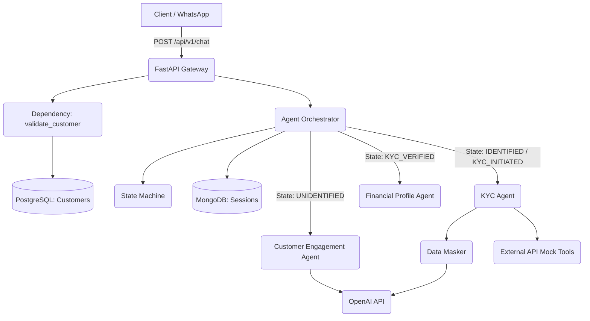
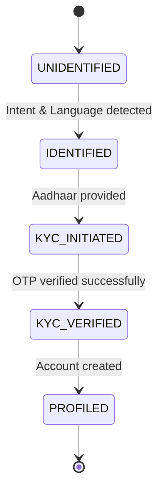

# SBI Saarthi API Gateway

## Executive Summary

**SBI Saarthi API Gateway** is an AI-driven, multi-agent conversational system designed to facilitate seamless and secure banking customer onboarding, KYC verification, and financial profiling. Built to integrate with channels like WhatsApp, it acts as a virtual "front desk" and verification officer, engaging customers naturally while securely routing them through standard banking workflows. 

**Business Purpose:** To automate and streamline customer interactions for State Bank of India (or similar financial institutions) by leveraging LLMs to handle initial queries, identity verification, and profile creation without human intervention until absolutely necessary.

**Target Users:** 
- Retail banking customers (interacting via chat interfaces).
- Compliance and underwriting officers (handling escalations and approvals).

**Key Capabilities:**
- Natural language chat via state-machine-driven AI agents.
- Real-time PII data masking (Aadhaar, PAN) for security and compliance.
- Automated eKYC flows using mock UIDAI and PAN verification tools.
- Intelligent state management (Unidentified -> Identified -> KYC Initiated -> KYC Verified).
- Event-driven architecture with an audit logging mechanism.

---

## Architecture Overview

SBI Saarthi uses a **Multi-Agent Orchestration Architecture** backed by an API Gateway. The system intercepts chat requests, validates user identities, and routes conversations to specialized LLM agents based on the current state of a deterministic workflow.

**System Responsibilities:**
- **FastAPI Gateway:** Handles incoming REST requests and user validation.
- **Orchestrator:** Manages session state, routes messages to appropriate sub-agents, and persists chat history.
- **State Machine:** Enforces a rigid progression of customer onboarding stages.
- **Agents:** Specialized LLMs (Customer Engagement, KYC, Financial Profile) execute distinct business logic.
- **DataMasker:** Intercepts outgoing LLM prompts to redact sensitive data (PII vaulting) and unmasks tool call arguments.

### Architecture Diagram



---

## Technology Stack

| Layer | Technology | Purpose |
|---------|------------|----------|
| **Backend** | Python 3, FastAPI, Uvicorn | High-performance API framework and server. |
| **Relational Database** | PostgreSQL, SQLAlchemy | Persistent storage for Customers, Accounts, Audit Logs. |
| **NoSQL Database** | MongoDB, PyMongo | Fast, flexible storage for session state and chat history. |
| **AI / LLM** | OpenAI API | Brain of the conversational agents. |
| **Validation** | Pydantic | Schema definition, type hinting, and request/response validation. |
| **Security** | Custom Regex Vaulting | Dynamic PII masking (Aadhaar, PAN) before LLM egress. |

---

## Project Structure

```text
D:\Work\Github\SBISaarthi\
├── agents/                  # Multi-agent LLM logic
│   ├── base_agent.py        # Abstract agent handling OpenAI interactions and tool calls
│   ├── orchestrator.py      # Main router managing session memory and state transitions
│   ├── customer_engagement.py # First-touch agent for greeting and intent detection
│   ├── kyc.py               # Verification agent for Aadhaar/PAN collection
│   ├── financial_profile.py # Agent for assessing financial health post-KYC
│   └── ...                  # Other specialized agents (compliance, fraud, etc.)
├── constants/               # System-wide static variables
│   └── enums.py             # Enums like KYCStatus, RiskTier
├── controllers/             # API Route handlers
│   └── chat_endpoints.py    # Main /api/v1/chat controller logic
├── core/                    # Core engine components
│   ├── event_bus.py         # Pub/Sub event dispatcher for async tasks
│   ├── security.py          # DataMasker for real-time PII redaction
│   └── state_machine.py     # State transitions (UNIDENTIFIED -> KYC_VERIFIED -> ...)
├── database/                # Database configurations and helpers
│   ├── models/              # SQLAlchemy relational models (customer, account, audit_log)
│   ├── validation/          # Pydantic models (MessageRequest, MessageResponse)
│   ├── postgres.py          # SQLAlchemy engine and session setup
│   ├── postgres_helpers.py  # CRUD operations for Postgres
│   ├── mongo_helpers.py     # Session read/write operations for MongoDB
│   └── schemas.py           # Additional Pydantic DTOs
├── middlewares/             # Request interception
│   └── dependencies.py      # Customer validation dependency injection
├── tools/                   # External tool adapters for LLM function calling
│   ├── account_aggregator.py
│   ├── pan_verification.py  # Mock NSDL PAN verification
│   └── uidai.py             # Mock Aadhaar eKYC initiator
├── main.py                  # FastAPI application entry point
├── requirements.txt         # Python dependencies
└── .env.example             # Environment variable template
```

---

## Execution Flow

1. **Application Startup:** Uvicorn starts FastAPI defined in `main.py`. Databases are connected.
2. **Request Lifecycle:**
   - A POST request with `{ "phone_number": "...", "message": "..." }` arrives.
   - `validate_customer` dependency checks Postgres for the user by phone number, creating a temporary customer if none exists.
3. **Agent Lifecycle:**
   - `chat_endpoints.py` looks up the active MongoDB session for the user. If none, it asks `Orchestrator` to create one.
   - `Orchestrator` evaluates the `workflow_state` via `StateMachine`.
   - The user message is passed to the relevant `BaseAgent` subclass (e.g., `CustomerEngagementAgent`).
   - The message is filtered through `DataMasker` to replace PAN/Aadhaar with tokens.
   - LLM responds, potentially triggering a function call (e.g., `initiate_ekyc`).
   - Tool arguments are unmasked, executed, and the tool response is sent back to the LLM.
4. **State Transition:** 
   - If business conditions are met (e.g., Aadhaar provided, OTP verified), `StateMachine` advances the workflow (e.g., `IDENTIFIED` -> `KYC_INITIATED`).
   - Postgres is updated (e.g., KYC status changed to VERIFIED, Account created).
5. **Response Generation:** The final AI response and new state are returned as a JSON `MessageResponse`.

---

## Core Components

### Orchestrator (`agents/orchestrator.py`)
- **Purpose:** Central brain mapping user inputs to agents based on state.
- **Responsibilities:** Session retrieval, state machine evaluation, context building, agent delegation, and memory persistence.
- **Dependencies:** MongoDB helpers, StateMachine, specialized agents.

### DataMasker (`core/security.py`)
- **Purpose:** Protects PII from leaving the internal network.
- **Responsibilities:** Intercepts strings, applies regex to find Aadhaar/PAN, replaces them with short-lived UUID tokens, and vaults the mapping in memory. Unmasks tool arguments before internal execution.

### StateMachine (`core/state_machine.py`)
- **Purpose:** Enforces deterministic onboarding workflows.
- **Internal Workflow:** Maintains a directed graph of allowed state transitions (`UNIDENTIFIED` -> `IDENTIFIED` -> `KYC_INITIATED` -> `KYC_VERIFIED` -> `PROFILED` -> `RISK_ASSESSED`).

---

## Data Models

**Database Models (PostgreSQL):**
| Entity | Description | Core Fields |
|--------|-------------|-------------|
| `Customer` | User identity record | `customer_id`, `phone_number`, `kyc_status`, `risk_tier` |
| `Account` | Bank account record | `account_id`, `customer_id`, `account_type`, `balance` |
| `AuditLog` | Cryptographic activity log | `log_id`, `customer_id`, `action_type`, `cryptographic_hash` |

**Session Memory (MongoDB):**
| Field | Type | Purpose |
|-------|------|---------|
| `session_id` | string | Unique conversation tracker |
| `workflow_state` | string | Current state in StateMachine |
| `messages` | list | Chat history for LLM context window |
| `extracted_facts` | dict | Persisted user preferences (e.g., language) |

---

## State Management

Session state is persisted in MongoDB. The active `workflow_state` dictates system behavior.



---

## Environment Variables

| Variable | Required | Description |
|-----------|----------|-------------|
| `MODE` | Yes | `development` or `production` |
| `OPENAI_API_KEY` | Yes | Key for LLM generation |
| `LLM_BASE_URL` | No | Optional proxy for LLM |
| `POSTGRES_URL` | Yes | Postgres connection string |
| `MONGO_CONNECTION_STRING` | Yes | MongoDB connection string |
| `MOCK_NUM` | No | Dev mock phone number |
| `UIDAI_API_KEY` | No | Mock key for Aadhaar tool |
| `CKYC_API_KEY` | No | Mock key for CKYC tool |

---

## Installation

### Prerequisites
- Python 3.10+
- PostgreSQL Server
- MongoDB Server

### Local Setup
1. Clone the repository.
2. Create virtual environment: `python -m venv .venv`
3. Activate: `.venv\Scripts\activate` (Windows) or `source .venv/bin/activate` (Mac/Linux).
4. Install dependencies: `pip install -r requirements.txt`
5. Copy `.env.example` to `.env` and configure your keys and DB URLs.
6. Initialize Database (Ensure Postgres and Mongo are running).
   ```bash
   python -m database.setup_db
   ```

---

## Running The Project

**Development:**
```bash
uvicorn main:app --reload --host 0.0.0.0 --port 8000
```

---

## API Overview

The core interactions occur over REST. Detailed endpoint documentation is available in `API_DOCUMENTATION.md`.
- **POST /api/v1/chat**: Primary conversational endpoint for customer interaction.

---

## Security Architecture

- **Data Masking:** `DataMasker` guarantees that Aadhaar and PAN numbers are redacted before prompts are sent to OpenAI.
- **Audit Logging:** Crucial actions (like KYC verification and Account creation) are intended to be logged with cryptographic hashes in the `audit_logs` table for compliance.
- **Session Isolation:** MongoDB sessions are strictly tied to unique `customer_id` generated from phone number validation.

---

## Known Risks & Improvement Opportunities

| Priority | Recommendation | Impact |
|-----------|---------------|---------|
| **High** | Vault Persistence | `DataMasker` uses in-memory dictionary. Fails on multi-worker setup. Move vault to Redis. |
| **High** | Session Management | `DataMasker` is global; cross-session contamination is possible. Scope vaulting per session. |
| **Medium** | Async DB Operations | Move SQLAlchemy and PyMongo calls to `async` (Motor/asyncpg) to prevent FastAPI worker blocking. |
| **Medium** | Error Handling | Add global exception handlers to FastAPI to return standardized HTTP 500/400 JSON responses. |
| **Low** | Agent Factory | Dynamic loading of agents in Orchestrator to reduce memory overhead and initialization time. |

---

## Developer Onboarding Guide

- **Where to start:** Look at `main.py` -> `controllers/chat_endpoints.py` -> `agents/orchestrator.py`. This is the critical path for a request.
- **Modifying Agents:** To add a new capability, create a new class inheriting from `BaseAgent` in `agents/`, add it to the `StateMachine` in `core/state_machine.py`, and map it in the `Orchestrator`.
- **Debugging:** Check the MongoDB `sessions` collection to see exactly what facts the LLM has extracted and what the chat history looks like.

---

## Glossary

- **PII:** Personally Identifiable Information (PAN, Aadhaar).
- **KYC:** Know Your Customer.
- **UIDAI:** Unique Identification Authority of India (Aadhaar issuer).
- **NSDL*:** National Securities Depository Limited. 
- **Orchestrator:** The router logic managing agent delegation.
