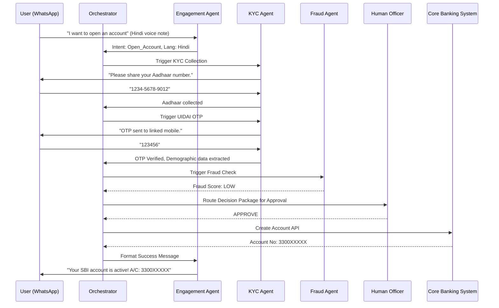

# SBI Saarthi: AI-Native Digital Branch Architecture

## A. Executive Summary
**SBI Saarthi** is a revolutionary AI-native digital banking branch designed to provide a seamless, hyper-personalized, and highly accessible banking experience for the next billion users. Unlike traditional chatbots, Saarthi operates as a coordinated team of specialized AI agents working together through a centralized orchestration engine. It facilitates an end-to-end user journey—from initial greeting to account opening and instant loan eligibility—within a single, continuous conversation spanning multiple channels (Voice, WhatsApp, YONO App, Web, Branch Kiosks). Built with native support for Indian languages, voice-first interactions, and accessibility features, Saarthi ensures regulatory compliance, strict data privacy, and mandatory Human-in-the-Loop (HITL) checkpoints for critical banking operations.

## B. Complete System Architecture

### 1. High-Level System Architecture
The system is divided into four main layers:
1.  **Experience Layer (Multimodal & Cross-Channel):** Manages user inputs (Voice, Text, Video/ISL) across WhatsApp, YONO, IVR, Web, and Kiosks. Handles real-time STT/TTS (Speech-to-Text/Text-to-Speech) using Bhashini or similar Indic-language models.
2.  **Orchestration & State Layer:** The central brain (Orchestrator Agent) managing the event bus, state machine, and Shared Memory system.
3.  **Agent Layer:** A swarm of 11 specialized LLM-powered agents with discrete responsibilities, acting as microservices.
4.  **Core Integration Layer (Tools):** API adapters connecting agents to underlying banking systems (CBS, LOS, UIDAI, CKYC, DigiLocker, AA, Fraud APIs).

### 2. Multi-Agent Communication Architecture
-   **Pattern:** Blackboard / Event-Driven Architecture.
-   **Mechanism:** Agents do not communicate directly with each other (avoiding tight coupling and circular dependencies). Instead, they publish observations and recommendations to a centralized **Shared Context (Blackboard)**.
-   **Orchestrator:** Subscribes to the Blackboard, evaluates the current state against the global State Machine, and triggers the next appropriate Agent.

### 3. Shared Memory Architecture
The memory system is decoupled into three tiers:
-   **Working Memory (Redis):** Fast, ephemeral context for the current turn/interaction.
-   **Session Memory (DynamoDB/Cassandra):** The current conversation's state, accumulated facts, gathered documents, and incomplete intents. Expires after the session ends or times out.
-   **Long-Term Memory (Vector DB + Relational DB):** Persistent user profile, past interactions, KYC status, language preferences, and historical risk scores.

### 4. Event-Driven Workflow & State Machine
The user journey is governed by a robust Directed Acyclic Graph (DAG) state machine:
`UNIDENTIFIED` -> `IDENTIFIED` -> `KYC_INITIATED` -> `KYC_VERIFIED` -> `PROFILED` -> `RISK_ASSESSED` -> `PENDING_HUMAN_APPROVAL` -> `ACCOUNT_ACTIVE` -> `CREDIT_EVALUATED`.
Transitioning between states emits domain events (e.g., `DocumentUploaded`, `FraudCheckFailed`) on a Kafka/Redpanda Event Bus, triggering respective agents.

## C. Agent-by-Agent Specifications

### 1. Customer Engagement Agent
*   **Role:** The charismatic "front desk". Greets the customer, parses the initial intent, detects language from input (text/voice), and manages the tone of the conversation.
*   **Capabilities:** Language identification (LID), intent routing, tone adaptation.
*   **Tools:** Bhashini Translation API, NLP Intent Classifier.

### 2. Accessibility Agent
*   **Role:** Analyzes interaction patterns (e.g., typos, slow response, specific voice cues) to detect low literacy or accessibility needs. Seamlessly shifts the UI/UX mode.
*   **Capabilities:** Switches system to "Voice-First Mode", activates visual aids/large text, or triggers ISL (Indian Sign Language) 3D avatars.
*   **Tools:** TTS/STT engines, ISL Avatar Generator engine.

### 3. Trust & Education Agent
*   **Role:** The empathetic guide. Detects user hesitation or confusion. Explains *why* data is needed (e.g., "We need your Aadhaar to keep your money safe according to RBI rules").
*   **Capabilities:** Anxiety detection (via NLP sentiment), dynamic FAQ generation, simplified consent explanation.
*   **Tools:** Standard Operating Procedure (SOP) RAG retrieval.

### 4. KYC Agent
*   **Role:** The meticulous verification officer. Drives the collection of identity data.
*   **Capabilities:** Prompts for Aadhaar/PAN, initiates OTP flows, queries CKYC registry.
*   **Tools:** Aadhaar eKYC API, CKYC Registry API, PAN NSDL API.

### 5. Document Intelligence Agent
*   **Role:** The backend clerk. Processes raw uploads (images, PDFs) or fetches digital equivalents.
*   **Capabilities:** Extracts structured data from ID cards, fetches verified docs via DigiLocker. Re-prompts if the image is blurry.
*   **Tools:** Vision LLM (for OCR/Extraction), DigiLocker API adapter.

### 6. Fraud & Risk Agent
*   **Role:** The silent security guard. Monitors all inputs in the background.
*   **Capabilities:** Validates liveness in video KYC, detects voice deepfakes, analyzes behavioral biometrics (typing speed, hesitation), cross-references identity watchlists.
*   **Tools:** Liveness Detection API, Deepfake Audio Scan API, AML/CFT Watchlist API.

### 7. Financial Profile Agent
*   **Role:** The data analyst. Builds a comprehensive financial picture.
*   **Capabilities:** Triggers Account Aggregator (AA) consent flows, parses bank statements, categorizes income, calculates cash flow and debt-to-income (DTI) ratios.
*   **Tools:** Sahamati/AA ecosystem APIs.

### 8. Credit Underwriting Agent
*   **Role:** The loan officer. Uses the financial profile to recommend products.
*   **Capabilities:** Calculates risk scores based on internal ML models, assesses loan eligibility, generates pre-approved offers.
*   **Tools:** LOS (Loan Origination System), Credit Bureau APIs (CIBIL/Equifax).

### 9. Compliance Agent
*   **Role:** The strict auditor. Ensures the Orchestrator doesn't bypass any regulatory steps.
*   **Capabilities:** Verifies explicit consent logs, ensures RBI mandate compliance, signs off on the final payload before routing to human.
*   **Tools:** Audit Logging System, Digital Signature Service.

### 10. Memory Agent
*   **Role:** The historian. Manages reads/writes to the Shared Memory architecture.
*   **Capabilities:** Entity extraction and resolution, cross-channel context merging (e.g., user drops off WhatsApp, calls IVR -> Memory Agent provides state).
*   **Tools:** Redis, Vector DB (Milvus/Pinecone), RDBMS.

### 11. Human Officer Agent (Copilot)
*   **Role:** The bridge to the human branch manager.
*   **Capabilities:** Compiles a concise "Decision Package" (Summary, KYC status, Fraud Score, Financial Profile, Transcript). Presents this to the human officer on a dashboard for final 1-click approval/rejection.
*   **Tools:** Internal Bank CRM/Dashboard, Notification SMS/Email APIs.

---

## D. Event Flows (Scenarios)

### Scenario 1: Farmer with Aadhaar but no PAN
1.  **Engagement Agent:** Greets farmer via Voice Call (Hindi).
2.  **KYC Agent:** Requests Aadhaar and PAN. Farmer provides Aadhaar but says "I don't have a PAN card."
3.  **Trust & Education Agent:** Steps in to reassure: "That is completely fine. For opening a basic savings account, we can proceed with just your Aadhaar and a simple Form 60 declaration."
4.  **Compliance Agent:** Logs the absence of PAN and triggers Form 60 protocol.

### Scenario 2: Customer switches from Voice Call to WhatsApp
1.  **Engagement Agent:** Interacts with user on IVR. User drops off mid-KYC due to poor network.
2.  **Memory Agent:** Saves `SessionState=KYC_INITIATED`, channel=`IVR`.
3.  User texts "Hi" to Saarthi WhatsApp number 2 hours later.
4.  **Engagement Agent:** Recognizes phone number.
5.  **Memory Agent:** Retrieves session state.
6.  **Engagement Agent:** "Welcome back! We were verifying your Aadhaar earlier on the call. Shall we continue here on WhatsApp?"

### Scenario 3: Low literacy customer
1.  **Engagement Agent:** Customer sends voice notes with heavy regional dialect and mispronunciations on WhatsApp.
2.  **Accessibility Agent:** Detects low text comprehension and dialect. Switches interaction mode. Replies are sent primarily as Voice Notes in the specific dialect, accompanied by large, simple emojis (✅, ❌, 📷).
3.  **Document Agent:** When asking for documents, Trust Agent sends a sample photo showing *how* to hold the ID card clearly.

### Scenario 4: Suspected fraud attempt
1.  **Document Agent:** Receives a photo of a PAN card.
2.  **Fraud & Risk Agent:** Scans the image. Detects EXIF data mismatch and digital manipulation (photoshop artifacts on the name).
3.  **Orchestrator:** Halts the automated flow.
4.  **Human Officer Agent:** Routes the session immediately to the Fraud Desk with a High Priority flag, showing the manipulated image regions.
5.  **Engagement Agent:** "We need a bit more time to verify your details. One of our officers will call you shortly."

### Scenario 5: Account opening to instant loan
1.  **Orchestrator:** Receives `Account_Activated` event after human approval.
2.  **Engagement Agent:** "Congratulations, your account is open! Based on your profile, would you like to check if you are eligible for an instant Kisaan Credit Card?"
3.  **Financial Profile Agent:** Triggers Account Aggregator consent to pull past 6 months data from the user's *previous* bank.
4.  **Credit Underwriting Agent:** Analyzes AA data, approves a 50k limit. Offers it instantly.

---

## E. Database Design (Core Schemas)

**1. Customer Profile (Relational - PostgreSQL)**
```sql
CREATE TABLE customers (
    customer_id UUID PRIMARY KEY,
    phone_number VARCHAR(15) UNIQUE,
    preferred_language VARCHAR(10),
    kyc_status ENUM('PENDING', 'PARTIAL', 'VERIFIED', 'REJECTED'),
    risk_tier ENUM('LOW', 'MEDIUM', 'HIGH'),
    created_at TIMESTAMP
);
```

**2. Session State (NoSQL - MongoDB)**
```json
{
  "session_id": "sess_898a9b",
  "customer_id": "cust_123",
  "current_state": "WAITING_FOR_AADHAAR_OTP",
  "channel": "WHATSAPP",
  "collected_entities": {
    "aadhaar_number": "XXXX-XXXX-1234",
    "name_match_score": 0.95
  },
  "last_interaction_at": "2026-06-25T01:30:00Z"
}
```

**3. Consent & Audit Ledger (Append-Only/Immutable)**
```sql
CREATE TABLE audit_logs (
    log_id UUID PRIMARY KEY,
    customer_id UUID,
    agent_id VARCHAR(50),
    action_type VARCHAR(50), -- e.g., 'CIBIL_PULL_CONSENT'
    timestamp TIMESTAMP,
    cryptographic_hash VARCHAR(256), -- For non-repudiation
    metadata JSONB
);
```

---

## F. API Specifications (Tool Adapters)

**1. Aadhaar eKYC Adapter (RESTful)**
```http
POST /adapters/uidai/ekyc/initiate
{
  "uid": "123412341234",
  "consent": true,
  "purpose": "Account Opening"
}
Response: 200 OK { "txn_id": "tx123", "status": "OTP_SENT" }
```

**2. Account Aggregator (AA) Adapter**
```http
POST /adapters/sahamati/consent/request
{
  "fiu_id": "SBI_FIU",
  "customer_vua": "9999999999@sbi",
  "datatypes": ["DEPOSIT", "TERM_DEPOSIT"],
  "date_range": { "start": "2025-06-01", "end": "2026-06-01" }
}
Response: 200 OK { "consent_handle": "handle_abc", "url": "https://aa.com/consent/..." }
```

---

## G. Sequence Diagrams (Mermaid)



---

## H. Security & Compliance Design
-   **Data Masking:** PII/PCI data (Aadhaar, PAN, Account numbers) are masked before entering LLM context windows using a regex-based sanitization proxy. Only secure token references are passed to agents.
-   **Consent Architecture:** Every external API call (Bureau, AA, UIDAI) requires a cryptographically signed consent token explicitly granted by the user and verified by the Compliance Agent.
-   **Network:** Deployed within SBI's virtual private cloud (VPC). No inbound internet traffic to the Core Agents; all traffic flows through an API Gateway with WAF.
-   **Explainability:** The Underwriting Agent outputs a local-interpretable (SHAP) feature importance array alongside its credit score, stored in the Decision Package for RBI auditability.

---

## I. Failure Handling Design
-   **LLM Hallucination/Stuck Loops:** The Orchestrator limits consecutive turns by the same agent. If an agent loops >3 times without progressing the state machine, the Orchestrator forces a transition to the Human Officer Agent with a `System_Stuck` flag.
-   **Third-Party API Downtime (e.g., UIDAI down):** Core Adapters implement Circuit Breakers. If UIDAI fails, the Adapter emits `UIDAI_Offline`. The Orchestrator pauses the workflow, and the Engagement Agent informs the user: "The central server is currently slow. We have saved your progress and will notify you when it's back up."
-   **Graceful Degradation:** If the primary LLM (e.g., GPT-4o/Gemini 1.5 Pro) latency spikes, the system falls back to a smaller, faster local model (e.g., Llama 3 8B) tuned strictly for intent routing and holding messages.

---

## J. MVP Roadmap (0-6 Months)
*   **Month 1-2:** Foundation. Setup Orchestrator, Engagement Agent, and Memory Agent. Connect WhatsApp and Web channels.
*   **Month 3-4:** Core Banking. Implement KYC Agent, Document Agent, and Compliance Agent. Integrate UIDAI, PAN, and internal CBS dummy APIs.
*   **Month 5:** Safety & Polish. Implement Fraud Agent and Human Officer Dashboard. Conduct red-teaming for prompt injections.
*   **Month 6:** Pilot Launch. Roll out in 5 rural branches via Kiosks and assisted WhatsApp flows for Savings Accounts only.

---

## K. Future Expansion Roadmap (6-18 Months)
*   **Phase 2 (Months 6-9):** Launch Financial Profile and Credit Underwriting Agents. Enable instant two-wheeler and Kisaan loans based on Account Aggregator data.
*   **Phase 3 (Months 9-12):** Deploy Native Voice IVR integration and YONO App embedded voice-assistant. Activate Accessibility Agent's ISL avatar.
*   **Phase 4 (Months 12-18):** Wealth Management. Introduce new agents for mutual fund advisory and micro-insurance, fully compliant with SEBI/IRDAI norms. Cross-border remittance support.
